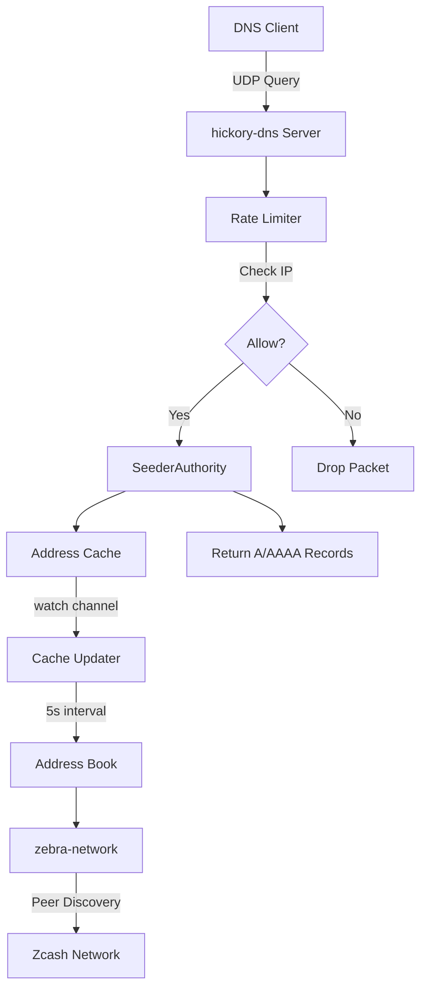
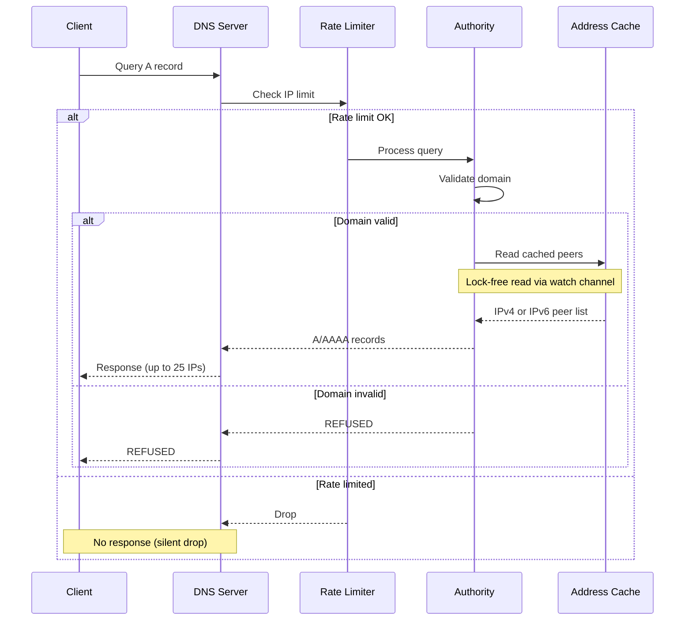
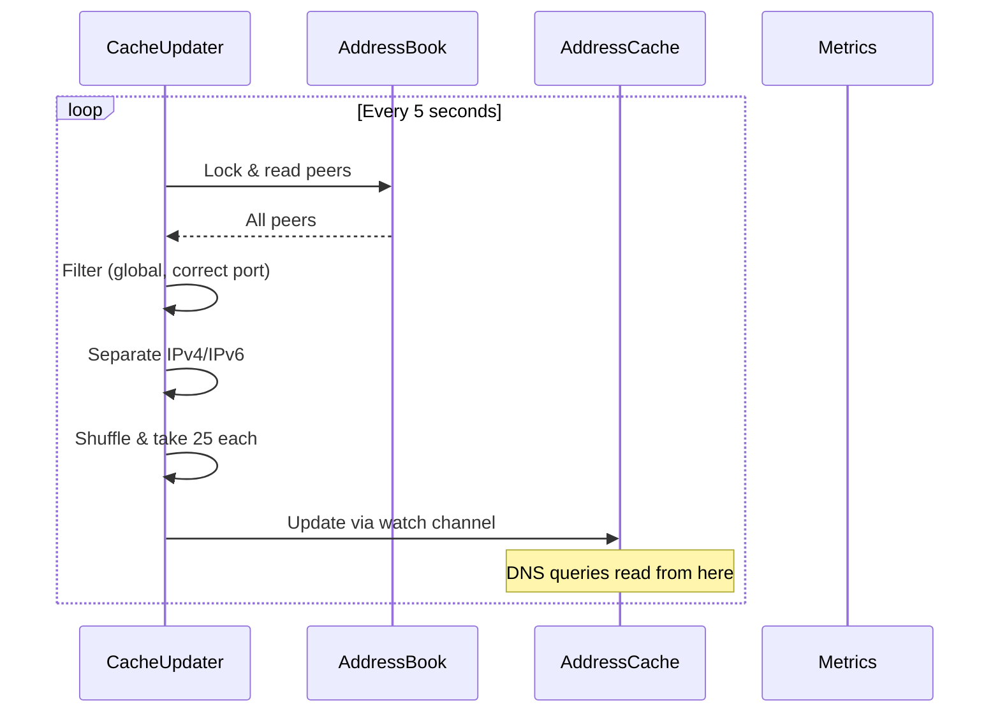
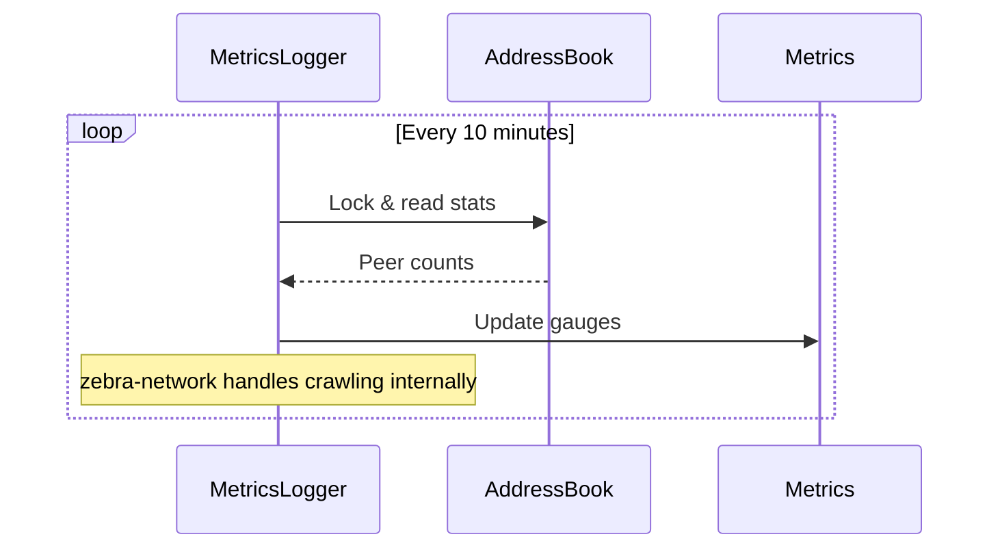

# Architecture

## Overview

zebra-seeder is a DNS seeder for Zcash that crawls the network and serves DNS records pointing to healthy peers.



### Core Components

- **zebra-network**: Handles Zcash P2P networking and peer discovery
- **hickory-dns**: DNS server framework
- **Rate Limiter**: Per-IP rate limiting using governor crate
- **Address Cache**: Lock-free cache of eligible peers, updated every 5 seconds
- **Address Book**: Thread-safe peer storage managed by zebra-network
- **Metrics**: Prometheus metrics via metrics-exporter-prometheus

## Data Flow

### Startup Sequence

1. Load configuration (env vars → TOML → defaults)
2. Initialize metrics endpoint (if enabled)
3. Initialize zebra-network with address book
4. Create rate limiter (if enabled)
5. Spawn address cache updater (updates every 5 seconds)
6. Start DNS server on configured port
7. Spawn metrics logger task (logs status every 10 minutes)

### DNS Query Handling



**Steps:**
1. Client sends DNS query
2. Rate limiter checks if IP is within limits
3. If rate-limited: packet dropped silently (no amplification)
4. If allowed: validate domain matches `seed_domain`
5. Read from cached addresses (lock-free via watch channel)
6. Return pre-filtered and shuffled peer list as DNS response

### Address Cache Updates



**How it works:**
- Background task updates cache every 5 seconds
- Cache contains pre-filtered, pre-shuffled IPv4 and IPv6 lists
- DNS queries read from cache without locking (via tokio `watch` channel)
- Eliminates lock contention during high query load

### Metrics Logging



**How it works:**
- zebra-network continuously discovers and manages peers
- Metrics logger periodically logs Address Book stats
- Metrics updated with peer counts (total, eligible IPv4/IPv6)

## Components Deep Dive

### zebra-network Integration

**What:** Zcash P2P networking library from the Zebra project

**Responsibilities:**
- Peer discovery via DNS seeds and peer exchange
- Connection management
- Protocol message handling
- Address book maintenance

**Our usage:**
- Initialize with config and dummy inbound service (reject all)
- Access Address Book for peer list
- Never send blockchain data (we're not a full node)

**Files:** `src/server.rs` (initialization)

---

### hickory-dns Server

**What:** Async DNS server framework (formerly trust-dns)

**Responsibilities:**
- DNS protocol handling (UDP/TCP)
- Query parsing
- Response building

**Our usage:**
- Implement `RequestHandler` trait via `SeederAuthority`
- Handle A and AAAA queries
- Return REFUSED for unauthorized domains

**Files:** `src/server.rs` (authority implementation)

---

### Rate Limiter

**What:** Per-IP rate limiting to prevent DDoS amplification

**Implementation:**
- `governor` crate with token bucket algorithm
- `DashMap` for concurrent IP tracking
- Each IP gets isolated rate limiter instance

**Configuration:**
- Default: 10 queries/second per IP
- Burst: 20 queries (2x rate)
- Configurable via `rate_limit` config section

**Behavior:**
- Rate-limited requests: dropped silently (no response)
- Metric: `seeder.dns.rate_limited_total`

**Files:** `src/server.rs` (`RateLimiter` struct), `src/config.rs` (`RateLimitConfig`)

---

### Address Cache

**What:** Lock-free cache providing pre-filtered peer addresses for DNS responses

**Problem Solved:**
- Original design locked the address book mutex on every DNS query
- Under high query load, this caused lock contention
- Queries backed up waiting for the mutex

**Solution:**
- Background task updates cache every 5 seconds
- Uses `tokio::sync::watch` channel for lock-free reads
- DNS queries read from cache without any locking

**Implementation:**
```rust
struct AddressRecords {
    ipv4: Vec<PeerSocketAddr>,  // Pre-filtered, shuffled
    ipv6: Vec<PeerSocketAddr>,  // Pre-filtered, shuffled
}

// Cache updater runs every 5 seconds:
// 1. Lock address book
// 2. Filter peers (global IPs, correct port)
// 3. Shuffle and take 25 each
// 4. Send to watch channel

// DNS handler reads without locking:
let peers = match record_type {
    A => cache.borrow().ipv4.clone(),
    AAAA => cache.borrow().ipv6.clone(),
};
```

**Trade-offs:**
- ✅ Zero lock contention during DNS queries
- ✅ Predictable low-latency responses
- ⚠️ Peer list may be up to 5 seconds stale (acceptable for DNS seeding)

**Files:** `src/server.rs` (`AddressRecords`, `spawn_addresses_cache_updater`)

---

### Address Book & Mutex Handling

**Mutex Strategy:**
- Address Book protected by `std::sync::Mutex`
- Only locked by cache updater (every 5 seconds) and metrics logger (every 10 minutes)
- DNS queries never lock the mutex directly

**Poisoning Recovery:**
- If thread panics while holding lock, mutex becomes "poisoned"
- We recover by calling `poisoned.into_inner()`
- Log error + increment metric
- Continue serving (availability over strict correctness)

**Peer Filtering (done in cache updater):**
- Global IPs only (no loopback, unspecified, multicast)
- Correct port (network default, usually 8233)
- Separated by address family (IPv4/IPv6)

---

### Configuration System

**Layered priority:**
1. Environment variables (`ZEBRA_SEEDER__*`)
2. TOML config file
3. Hardcoded defaults

**Implementation:**
- `config` crate for loading
- `serde` for deserialization
- `.env` file support via `dotenvy`

**Files:** `src/config.rs`, `src/commands.rs`

---

### Metrics

**Prometheus metrics exposed on configurable endpoint (default `:9999/metrics`)**

**Key metrics:**
- `seeder.peers.total` - Total peers in address book
- `seeder.peers.eligible` - Eligible peers (by address family)
- `seeder.dns.queries_total` - DNS queries (by record type)
- `seeder.dns.response_peers` - Histogram of peer count per response
- `seeder.dns.rate_limited_total` - Rate-limited queries
- `seeder.dns.errors_total` - DNS errors
- `seeder.mutex_poisoning_total` - Mutex poisoning events

**Files:** `src/metrics.rs`, `src/server.rs`

## Architecture Decision Records

### ADR 001: Use zebra-network for Peer Discovery

**Status:** Accepted

**Context:**  
We need to crawl the Zcash network to discover and maintain a list of healthy peers.

**Decision:**  
Use the `zebra-network` crate instead of implementing custom P2P networking.

**Rationale:**
- **Proven**: Battle-tested in Zebra full node
- **Avoids duplication**: Complex P2P logic already implemented
- **Protocol compatibility**: Follows Zcash protocol exactly
- **Maintenance**: Benefits from ongoing Zebra improvements
- **Reduced bugs**: Don't recreate peer discovery, connection management, etc.

**Consequences:**
- ✅ Faster development
- ✅ Reduced bug surface
- ✅ Protocol compliance guaranteed
- ⚠️ Dependency on zebra-network versions
- ⚠️ Must track Zebra releases for updates

**Alternatives Considered:**
- Custom P2P implementation - Rejected (too complex, high bug risk)
- libp2p - Rejected (incompatible with Zcash protocol)

---

### ADR 002: Use hickory-dns for DNS Server

**Status:** Accepted

**Context:**  
We need to serve DNS A/AAAA records to clients querying for Zcash peers.

**Decision:**  
Use the `hickory-dns` crate (formerly trust-dns) for DNS serving.

**Rationale:**
- **Mature**: Industry-standard Rust DNS implementation
- **RFC compliant**: Handles DNS protocol complexities correctly
- **Async native**: Works with tokio ecosystem
- **Feature-rich**: Supports all DNS record types we need
- **Tower integration**: Modern request/response abstraction

**Consequences:**
- ✅ Correct DNS protocol handling
- ✅ Good performance
- ✅ Well-maintained
- ⚠️ Additional dependency
- ⚠️ Learning curve for API

**Alternatives Considered:**
- Custom DNS parser - Rejected (too complex, error-prone, RFC compliance burden)
- trust-dns (old name) - N/A (hickory-dns is the successor)

---

### ADR 003: Implement Per-IP Rate Limiting

**Status:** Accepted

**Context:**  
DNS seeders on UDP port 53 are vulnerable to DNS amplification attacks where:
- Attackers forge source IP addresses
- Small queries trigger large responses
- Our seeder becomes a DDoS weapon

**Decision:**  
Implement per-IP rate limiting using `governor` crate:
- 10 queries/second per IP (default, configurable)
- Burst capacity of 20
- Silent packet dropping (no REFUSED response)

**Rationale:**
- **Security**: Prevents amplification attacks
- **Fairness**: No single IP can monopolize resources
- **Performance**: <1ms overhead with DashMap
- **Configurability**: Operators can tune based on traffic
- **Silent drops**: Avoid amplification (no error responses)

**Implementation:**
- `governor` crate for token bucket algorithm (GCRA)
- `DashMap` for per-IP tracking across threads in a single map
- Each IP gets isolated rate limiter instance
- Metrics track rate-limited requests

**Consequences:**
- ✅ Cannot be weaponized for DDoS
- ✅ Fair resource allocation
- ✅ Minimal performance impact
- ⚠️ Legitimate high-volume clients may be rate-limited
- ⚠️ Memory grows with unique IPs (acceptable: ~200 bytes/IP)

**Alternatives Considered:**
- No rate limiting - Rejected (unacceptable security risk)
- Global rate limit - Rejected (single client could DoS all others)
- Response size limiting - Rejected (insufficient, still allows amplification)

## Design Principles

1. **Security First**: Rate limiting and domain validation prevent abuse
2. **Availability**: Mutex poisoning recovery ensures continued operation
3. **Performance**: Concurrent data structures, early limiting, minimal allocations
4. **Observability**: Comprehensive metrics for monitoring
5. **Simplicity**: Leverage proven libraries (zebra-network, hickory-dns)
6. **Configurability**: All key parameters are configurable
