# Chain-tip-aware peer filter

> **⚠️ Experimental.** This subsystem is opt-in and currently lives on the
> `feat/tip-filter-experimental` branch — it has not yet shipped to `main`.
> Several pieces have not been exercised at production scale or against a
> live trusted RPC. See [Limitations](#limitations) before enabling it on
> a public seeder.

## Overview

The seeder normally returns any reachable peer in its address book that
is listening on the canonical port. There's no signal in the address
book about whether each peer is actually caught up to the chain tip, so
operators have at times reported that newly-joining nodes get pointed at
peers that are themselves far behind and can't help them sync.

The tip filter is an opt-in capability that addresses this directly:

1. A background **probe task** opens isolated Zcash version handshakes to
   peers it knows about and reads each peer's reported `start_height`.
2. From those samples it derives a **reference tip** (the P75 height —
   robust to ~25% laggard or adversarial noise).
3. DNS responses are **filtered** to peers within
   `tip_tolerance_blocks` of the reference tip. If too few synced peers
   are known for an address family, the filter **falls back** to the
   unfiltered set so new node onboarding is never black-holed.

When the filter is disabled (the default), the seeder behaves exactly as
before — `seeder.tip.*` and `seeder.probes.*` metrics simply don't appear.

## Architecture

```mermaid
graph TD
    AB[zebra_network::AddressBook] -->|peers&#40;&#41;| PT[Probe task<br/>src/probe.rs]
    PT -->|connect_isolated_tcp_direct + timeout| P[Remote peer<br/>version handshake]
    P -->|start_height| PT
    PT --> PM[ProbeMap<br/>src/tip_filter.rs]
    PM --> CR[compute_reference_tip<br/>P75 of fresh samples]
    RPC[Optional RPC poller<br/>src/rpc_tip.rs] -.fresh override.-> CR
    CR --> SS[TipFilterSnapshot<br/>via watch::Sender]
    SS --> CU[spawn_addresses_cache_updater<br/>src/server.rs]
    CU --> DNS[DNS A/AAAA response]
```



**Probe cycle (`probe_interval_secs`, default 60 s):**

1. Snapshot the address book under its mutex (with the standard
   poisoning recovery used elsewhere in the codebase).
2. Classify candidates: never-probed first, then stale (older than
   `probe_stale_after_secs`), then failed-and-due-to-retry under
   exponential backoff (`min(2^failures, 32) * 60s`).
3. Spawn child tasks gated by a `Semaphore` with
   `probe_concurrency` permits.
4. Each child wraps `zebra_network::connect_isolated_tcp_direct` in
   `tokio::time::timeout` (`probe_timeout_secs`), reads
   `client.connection_info.remote.start_height`, drops the client.
5. After the cycle drains, `prune_stale` removes entries older than
   `probe_stale_after_secs`, then `compute_reference_tip` rebuilds the
   `TipFilterSnapshot` and publishes it on the watch channel.

**DNS-serving path:** the existing cache updater
(`spawn_addresses_cache_updater`, runs every 5 s) reads the latest
snapshot. If a reference tip is published and the per-family synced
count meets `min_synced_peers`, the candidate set is narrowed to
`snapshot.synced_peers`; otherwise the unfiltered set is used and the
`seeder.tip.fallback_engaged` gauge goes to 1.

## Key design decisions

- **P75 (nearest-rank), not mean or max.** P75 sits in the upper
  cluster of synced peers and is robust to roughly 25% laggard or
  adversarial noise without needing trimmed-mean machinery.
- **Per-probe sanity cap.** `ProbeMap::record_success` rejects any
  reported height more than 100 blocks above the current observed max.
  After a small bootstrap window (3 successful entries) this defeats a
  single-peer attempt to poison P75 by claiming `u32::MAX`. Failure
  stubs are explicitly *excluded* from the baseline so a wave of probe
  failures does not lock out the next legitimate height (regression
  test `failure_stubs_do_not_break_sanity_cap_baseline` covers this).
- **Hard filter with safe fallback.** We never serve an empty
  response. When fewer than `min_synced_peers` synced peers are known
  for an address family, we fall back to the unfiltered set rather
  than risk locking new nodes out of the network entirely.
- **Spread is observed, not gating.** P25–P75 spread is recorded for
  observability but no longer suppresses tip publication. The address
  book always contains a healthy fraction of stale peers, so P25 sits
  far below tip by design and the spread is large during normal
  operation. (Real chain-partition detection would need an
  upper-cluster statistic — out of scope for now.)

## Enabling the filter

The filter is `None` by default. Setting **any** field under
`tip_filter` flips it on, with the remaining knobs at their defaults.

### Environment variables (preferred)

The seeder auto-loads `.env` from the working directory. Append to your
existing `.env`:

```bash
# Any one of these lines flips the filter on.
ZEBRA_SEEDER__TIP_FILTER__PROBE_CONCURRENCY="32"
# ZEBRA_SEEDER__TIP_FILTER__PROBE_INTERVAL_SECS="60"
# ZEBRA_SEEDER__TIP_FILTER__PROBE_TIMEOUT_SECS="10"
# ZEBRA_SEEDER__TIP_FILTER__PROBE_STALE_AFTER_SECS="600"
# ZEBRA_SEEDER__TIP_FILTER__TIP_TOLERANCE_BLOCKS="8"
# ZEBRA_SEEDER__TIP_FILTER__MIN_SYNCED_PEERS="16"
# ZEBRA_SEEDER__TIP_FILTER__MIN_PROBE_SAMPLE="8"

# Optional trusted-RPC override (zebrad or zcashd):
# ZEBRA_SEEDER__TIP_FILTER__RPC_OVERRIDE__URL="http://127.0.0.1:8232/"
# ZEBRA_SEEDER__TIP_FILTER__RPC_OVERRIDE__POLL_INTERVAL_SECS="30"
```

You'll know the filter is active when startup logs:
```
INFO zebra_seeder::server: Chain-tip-aware peer filter enabled probe_concurrency=32 probe_interval_secs=60 tip_tolerance_blocks=8
```

### TOML

```toml
[tip_filter]
# All fields optional; defaults shown.
probe_concurrency      = 32
probe_interval_secs    = 60
probe_timeout_secs     = 10
probe_stale_after_secs = 600
tip_tolerance_blocks   = 8
min_synced_peers       = 16
min_probe_sample       = 8

[tip_filter.rpc_override]
url                = "http://127.0.0.1:8232/"
poll_interval_secs = 30
# basic_auth       = ["user", "pass"]   # see RpcOverrideConfig note below
```

### Disabling

Remove the entire `[tip_filter]` block (TOML) or unset all
`ZEBRA_SEEDER__TIP_FILTER__*` env vars and restart. The seeder reverts
to its historical behavior with no probe traffic.

## Configuration reference

### `TipFilterConfig`

| Field | Env var | Default | Description |
|-------|---------|---------|-------------|
| `probe_concurrency` | `ZEBRA_SEEDER__TIP_FILTER__PROBE_CONCURRENCY` | `32` | Maximum in-flight probes. |
| `probe_interval_secs` | `ZEBRA_SEEDER__TIP_FILTER__PROBE_INTERVAL_SECS` | `60` | Outer scheduler tick. |
| `probe_timeout_secs` | `ZEBRA_SEEDER__TIP_FILTER__PROBE_TIMEOUT_SECS` | `10` | Per-probe total timeout wrapping TCP connect + handshake. |
| `probe_stale_after_secs` | `ZEBRA_SEEDER__TIP_FILTER__PROBE_STALE_AFTER_SECS` | `600` | Probe entries older than this are stale and re-probed; stale entries are pruned from the map at end-of-cycle. |
| `tip_tolerance_blocks` | `ZEBRA_SEEDER__TIP_FILTER__TIP_TOLERANCE_BLOCKS` | `8` | Maximum height delta from reference tip for "synced". ≈10 minutes at 75 s spacing. |
| `min_synced_peers` | `ZEBRA_SEEDER__TIP_FILTER__MIN_SYNCED_PEERS` | `16` | Per-address-family count below which the hard filter falls back to the unfiltered set. |
| `min_probe_sample` | `ZEBRA_SEEDER__TIP_FILTER__MIN_PROBE_SAMPLE` | `8` | Minimum fresh probe samples required before a reference tip is computed. |
| `rpc_override` | — | `None` | Optional `RpcOverrideConfig`, see below. |

Load-time validation rejects zero values for `probe_concurrency`,
`probe_interval_secs`, `probe_timeout_secs`, `min_synced_peers`, and
`min_probe_sample` (`TipFilterConfig::validate` in `src/config.rs`).

### `RpcOverrideConfig` (optional)

| Field | Env var | Default | Description |
|-------|---------|---------|-------------|
| `url` | `ZEBRA_SEEDER__TIP_FILTER__RPC_OVERRIDE__URL` | `""` | JSON-RPC endpoint of a trusted zebrad/zcashd. |
| `poll_interval_secs` | `ZEBRA_SEEDER__TIP_FILTER__RPC_OVERRIDE__POLL_INTERVAL_SECS` | `30` | RPC poll cadence. |
| `basic_auth` | — | `None` | `(user, pass)` tuple for zcashd-style basic auth. Easiest to set via TOML; the env-var form for tuples is not exercised here. |

When a fresh RPC reading (< 60 s old) is available, it replaces the
probe-derived P75 in the published snapshot and the
`seeder.tip.source{source="rpc"}` gauge goes to 1. After three
consecutive RPC failures the cached reading is invalidated and the
seeder falls back to probe-derived (`source="probe"`).

## Metrics

All metrics use the `metrics` crate macros and appear at the existing
`/metrics` endpoint only when the filter is enabled. Metric names in
the table below are as registered in code; Prometheus surfaces them
with `.` replaced by `_`.

| Metric | Type | Labels | Where | Meaning |
|---|---|---|---|---|
| `seeder.tip.reference_height` | gauge | — | `src/probe.rs` | Currently-published reference tip (probe-derived P75 or RPC). Only set when a tip is published. |
| `seeder.tip.sample_count` | gauge | — | `src/probe.rs` | Fresh successful-probe sample count feeding the percentile. |
| `seeder.tip.p25_to_p75_spread` | gauge | — | `src/probe.rs` | Observational only — see [Key design decisions](#key-design-decisions). |
| `seeder.tip.source` | gauge | `source="probe"\|"rpc"\|"unknown"` | `src/probe.rs` | One-hot: 1.0 on the active source, 0.0 on the others. |
| `seeder.tip.fallback_engaged` | gauge | `addr_family="v4"\|"v6"` | `src/server.rs` | 1.0 when the family fell back to unfiltered because `synced_count < min_synced_peers`. |
| `seeder.probes.in_flight` | gauge | — | `src/probe.rs` | Current semaphore usage. |
| `seeder.probes.map_size` | gauge | — | `src/probe.rs` | Entry count of the probe map. |
| `seeder.peers.synced` | gauge | `addr_family="v4"\|"v6"` | `src/probe.rs` | Authoritative per-family count of peers eligible for DNS responses after the tip filter. |
| `seeder.probes.attempted_total` | counter | — | `src/probe.rs` | Probes started. |
| `seeder.probes.succeeded_total` | counter | — | `src/probe.rs` | Handshakes that completed and yielded a height. |
| `seeder.probes.failed_total` | counter | `reason="handshake"\|"timeout"\|"sanity_cap"` | `src/probe.rs` | Probe-side failures (handshake error, total timeout, or sanity-cap rejection). |
| `seeder.probes.handshake_latency_seconds` | histogram | — | `src/probe.rs` | TCP-connect + handshake latency. p95/p99 informs `probe_timeout_secs` tuning. |
| `seeder.probes.reported_height_offset` | histogram | — | `src/probe.rs` | Signed `peer_height - reference_tip`. Shape of the distribution shows how laggy the address book is. |
| `seeder.tip.rpc_failures_total` | counter | — | `src/rpc_tip.rs` | Failed RPC poll attempts. Three in a row invalidate the cached reading. |
| `seeder.mutex_poisoning_total{location="probe_scheduler"}` | counter | — | `src/probe.rs` | New `location` label value; same metric name as the existing pre-tip-filter sites. |

## Logs

The tip filter never logs at warn/error during normal operation. The
default `--verbose info` is sufficient for monitoring.

**Startup (INFO):**
```
zebra_seeder::server: Chain-tip-aware peer filter enabled probe_concurrency=32 probe_interval_secs=60 tip_tolerance_blocks=8
```

**Per cycle (INFO):**
```
zebra_seeder::probe: probe cycle: starting count=N
zebra_seeder::probe: tip snapshot published reference_tip=Some(3358326) source=Probe sample_count=16 spread=2365077 synced_v4=12 synced_v6=0
```

`reference_tip=None` is normal during the first cycle (no tip published
yet) and persists if `sample_count < min_probe_sample`. `spread` will
typically be in the millions on a real seeder address book and is
informational only.

**Per peer (DEBUG, opt-in):**

Enable per-peer height logging with:
```
cargo run -- --verbose 'info,zebra_seeder::probe=debug' start
```

```
DEBUG zebra_seeder::probe: peer height observed peer=1.2.3.4:8233 height=3358326 user_agent=/Zebra:4.4.1/ status=synced
```

`status` values:
- `synced` — height ≥ `reference_tip - tip_tolerance_blocks`; the peer is in the served set.
- `behind` — height below that floor; excluded from DNS responses.
- `tip_unknown` — no reference tip has been published yet (first cycle, or `sample_count < min_probe_sample`).
- `outlier_rejected` — height was more than 100 blocks above the current
  max and the sanity cap refused it. Should be very rare; a sustained
  rate suggests an attacker is sweeping the address book or a real
  upstream change is in flight.

**Privacy note.** The per-peer log dereferences past
`zebra_network::PeerSocketAddr`'s deliberate IP redaction in order to
show the real address. It is gated to debug for that reason — only
operators opting in see real peer IPs.

## Debugging recipes

**Q: Which peers will be served right now?**
A: Read the latest `tip snapshot published` log line for the per-family
synced count, or scrape `seeder.peers.synced{addr_family="v4"}`. That is
the authoritative count after both the routability filter and the tip
filter; it is exactly the population the DNS path selects from.

**Q: Why is every peer showing `status=tip_unknown`?**
A: One of:
- The first cycle hasn't finished yet — wait one `probe_interval_secs`.
- `sample_count < min_probe_sample`. The address book is too small or
  most probes are failing. Lower `min_probe_sample`, raise probe
  concurrency, or let the address book warm up.

**Q: Why is the hard filter not engaging — DNS responses look unchanged?**
A: Check `seeder.tip.fallback_engaged{addr_family="v4"}` and v6. If
either is `1`, that family had fewer than `min_synced_peers` synced
peers and fell back to the unfiltered set. Either lower
`min_synced_peers` (with caution — small synced sets are easier to
overwhelm) or wait for more peers to be probed.

**Q: A peer reports `status=behind` but I think it's actually synced.**
A: Compare its reported height to the latest `tip snapshot published`
`reference_tip`. The tip in per-peer logs reflects the *previous*
cycle's published value (the new one is computed at end of cycle). If
the gap is just a few blocks at cycle boundaries that's expected
behavior; if it's persistent, the peer is genuinely behind.

**Q: I see `outlier_rejected`. What does that mean?**
A: The sanity cap refused a height more than 100 blocks above the
current max. A few during chain re-orgs are normal; sustained patterns
deserve attention — capture the offending peer addresses from the
DEBUG log.

## Limitations

- **Probe load not benchmarked at scale.** Defaults give roughly
  3 outbound probes/second at steady state, well below abuse territory,
  but this has not been measured against a real production seeder host.
- **Trusted-RPC override not exercised against live RPC.** The path
  exists and is wired correctly to fall back to probe-derived tip after
  three consecutive failures, but it has not been driven end-to-end
  against a running zebrad / zcashd. Treat it as untested until you
  have done so. `basic_auth` tuples in particular are easiest to set
  via the TOML config form; the env-var deserialization path for
  tuple-valued fields is not exercised here.
- **No real chain-partition detection.** An earlier version suppressed
  the published tip if `P25..P75 > 20 blocks`. This was removed
  because a real seeder address book is full of stale peers and that
  guard tripped every cycle. A genuine partition detector would need an
  upper-cluster statistic and is out of scope.
- **75 s block spacing assumed.** The default
  `tip_tolerance_blocks = 8` is sized for ~10 minutes of chain time at
  the current NU5 75 s target. Pre-NU5 testnets or regtest deployments
  would want a larger value.
- **Published tip lags one cycle.** The reference tip used by the
  DNS-serving filter is the snapshot published at the end of the
  *previous* cycle. The `status` field in per-peer logs reflects the
  same value. This is intentional (the new value is computed at the
  end of the cycle, after all probes complete) and means cycle-1
  results all show `status=tip_unknown` even when probes are
  succeeding — by cycle 2 a tip is published.
- **Env-var test coverage is partial.** `test_tip_filter_enabled_via_env`
  in `src/tests/config_tests.rs` exercises two TipFilterConfig fields
  (`probe_concurrency`, `tip_tolerance_blocks`). The remaining fields
  rely on the same `serde(default)` + `config` crate behaviour but are
  not individually asserted.

## Implementation pointers

| File | What lives there |
|------|------------------|
| `src/tip_filter.rs` | Pure types and logic: `ProbeEntry`, `ProbeMap`, `TipFilterSnapshot`, `TipSource`, `compute_reference_tip`, `classify_peer`, plus all unit and property tests. No I/O. |
| `src/probe.rs` | The probe task itself. `spawn()` returns a `watch::Receiver<TipFilterSnapshot>` plus a `JoinHandle`. `run_cycle`, `select_candidates`, `publish_snapshot`. Owns the `Semaphore` and the per-peer `last_attempt` HashMap. |
| `src/rpc_tip.rs` | Optional trusted-RPC poller. `RpcTipState`, `spawn(...)`, `poll_once(...)`. Uses `reqwest` with rustls. |
| `src/server.rs` (`spawn`) | Wires the probe task and optional RPC poller when `config.tip_filter.is_some()`; passes the receiver into the cache updater. |
| `src/server.rs` (`spawn_addresses_cache_updater`) | Applies the hard filter with safe fallback inside the existing 5-second cache-rebuild loop. |
| `src/config.rs` | `TipFilterConfig`, `RpcOverrideConfig`, `TipFilterConfig::validate()` (called from `SeederConfig::load_with_env`). |
| `src/tests/config_tests.rs` | `test_tip_filter_disabled_by_default`, `test_tip_filter_enabled_via_env`. |
